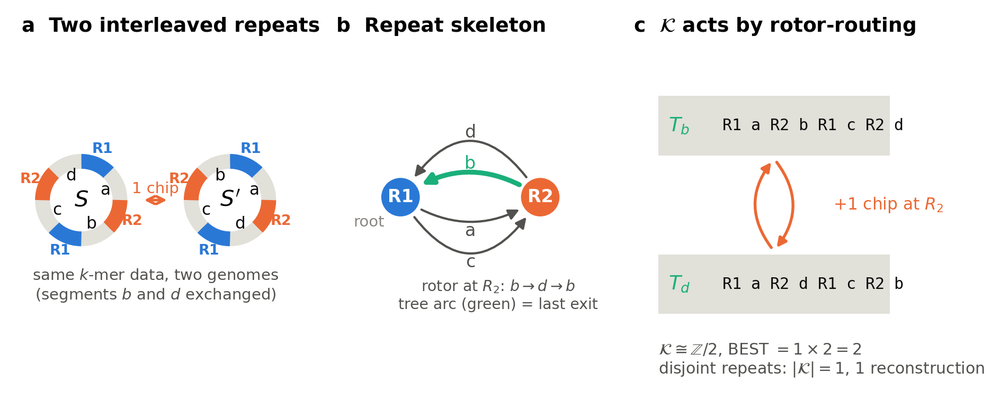
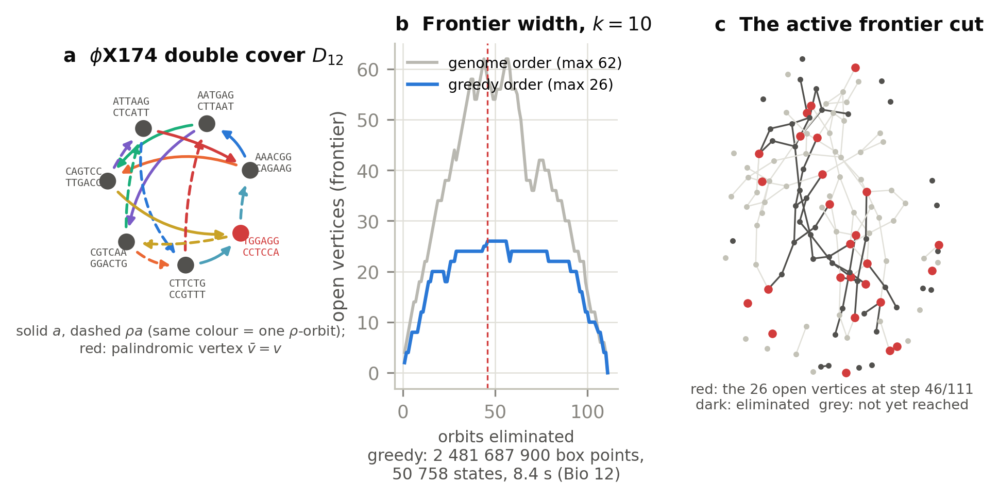
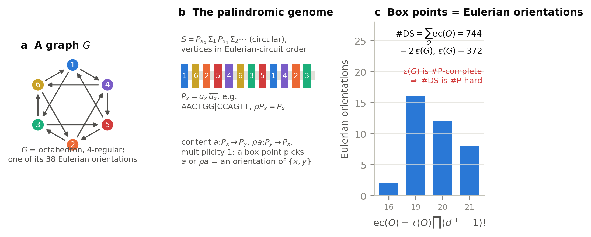
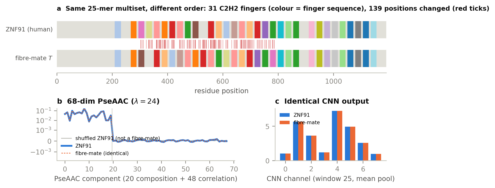
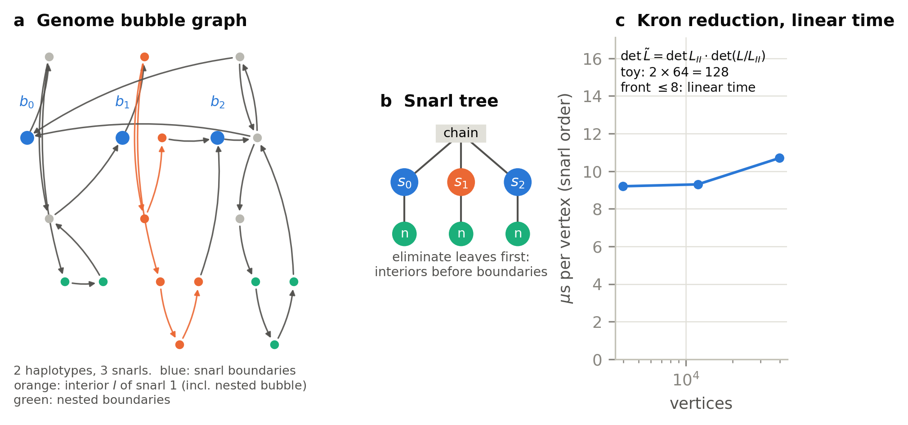

# Algebraic Genomics

### The Combinatorics of Sequence Reconstruction and Representation

[](https://doi.org/10.5281/zenodo.22943487)
[](LICENSE)
[](LICENSE-CC-BY-4.0.md)
[](requirements.txt)

**Ruqing Chen** · monograph, Papers Bio 1–19 · archived on Zenodo, DOI
[10.5281/zenodo.22943487](https://doi.org/10.5281/zenodo.22943487) · released 24 September 2026

> Exact Eulerian reconstruction, double-stranded spectral fibres, sandpile groups, and the
> computational complexity of sequence space.

A genome's *k*-mer data determine it only up to a **fibre**: the set of sequences with the same data.
For one strand the fibre is the set of Eulerian circuits of a de Bruijn graph. Its size is the BEST
determinant, which factors into a local part and a global part, the order of the sandpile group, and
the sandpile group splits along the repeats (Part I). For two strands the fibre is a union of such sets
over the points of a lattice in a box. Its size is a lattice sum of determinants. We compute it exactly
for φX174 at *k* = 10, **#DS = 31 925 753 246 212**, and prove that no closed formula exists: the
problem is **#P-hard** (Part II). The fibre is traversed by explicit moves. These are chips on one
strand, and transpositions and inversion flips on two. The same fibres are exactly what local sequence
encoders cannot see (Part III). Where the problem is tractable it is so for a reason that can be named:
bounded frontier or snarl width, repeat-only compaction, or linear structure. Those reasons give
linear-time algorithms on real genomes (Part IV).

Every chapter ships with a **verification script that reproduces its numbers exactly**, and one command
rebuilds and re-checks the whole monograph.

---

## Figures

| | |
|---|---|
|  **1 · Part I.** Two interleaved repeats: the sandpile group ℤ/2 acts on the two reconstructions by one rotor-routing chip. |  **2 · Part II.** φX174 double cover *D*₁₂ with the involution ρ and its palindromic vertex; frontier width 26 (greedy) vs 62 (genome order) at *k* = 10. |
|  **3 · Part II.** #DS = 2ε(*G*): palindromic vertices turn box points into Eulerian orientations, hence #P-hardness. |  **4 · Part III.** ZNF91 and a fibre-mate: same 25-spectrum, identical 68-dim PseAAC and CNN output, permuted zinc fingers. |
|  **5 · Part IV.** Snarl elimination is a Schur (Kron) reduction; the snarl order runs in linear time. | |

All figures are regenerated, and every number in them re-checked, by `python code/generate_figures.py`.

---

## Chapter matrix

Checks = the chapter script's own battery (`TOTAL a/b passed` in its reference transcript).
*quick*: runs in `build_all.py --quick`; *full*: only in `--full`.

| ch. | Part | paper | folder | core result | checks |
|---:|:---:|---|---|---|:---:|
| 1 | I | Bio 1 (XIV) | [`Bio_01_Critical_Groups`](papers/Bio_01_Critical_Groups) | BEST = local factor × \|𝒦(G_k)\|; equal degree data can give 4 vs 256 reconstructions; interleaving adds ℤ/2 | 30/30 quick |
| 2 | I | Bio 2 (XV) | [`Bio_02_Rotor_Routing`](papers/Bio_02_Rotor_Routing) | 𝒦 acts simply transitively by rotor-routing; φX174 at *k*=12: 𝒦 = ℤ/2, two reconstructions one chip apart | 8/8 quick |
| 3 | I | Bio 3 (XVI) | [`Bio_03_Repeat_Splitting`](papers/Bio_03_Repeat_Splitting) | 𝒦 ≅ ⊕(ℤ/r_c)^(ℓ_c−1) ⊕ 𝒦(Sk); two-copy skeleton = coker(A+I) of the interlace matrix | 7/7 quick |
| 4 | I | Bio 4 (XVII) | [`Bio_04_Multicopy_Repeats`](papers/Bio_04_Multicopy_Repeats) | three-copy repeats have no pairwise presentation (ℤ/3 vs ℤ/4) | 4/4 quick |
| 5 | II | Bio 6 (XIX) | [`Bio_06_RC_Double_Cover`](papers/Bio_06_RC_Double_Cover) | reverse-complement double cover *D_k*: balanced, connected iff an inverted repeat ≥ *k* | 6/6 quick |
| 6 | II | Bio 7 (XX) | [`Bio_07_Signed_Quotient`](papers/Bio_07_Signed_Quotient) | *D_k*/ρ is a signed graph; ρ is an anti-automorphism, giving a linking form | 9/9 full |
| 7 | II | Bio 8 (XXI) | [`Bio_08_DS_Lattice_Sum`](papers/Bio_08_DS_Lattice_Sum) | #DS as a lattice sum over Λ⁻; φX174: #DS = 10 (*k*=12), 864 (*k*=11) | 9/9 + 4/4 quick |
| 8 | II | Bio 12 (XXV) | [`Bio_12_Frontier_Elimination`](papers/Bio_12_Frontier_Elimination) | frontier elimination: 2 481 687 900 box points at *k*=10, width 26, 50 758 states | 8/8 quick |
| 9 | II | Bio 13 (XXVI) | [`Bio_13_Fermionic_Partition`](papers/Bio_13_Fermionic_Partition) | Berezin-integral form; **#DS(φX174, 10) = 31 925 753 246 212** | 7/7 + 4/4 quick |
| 10 | II | Bio 19 (XXXII) | [`Bio_19_SharpP_Hardness`](papers/Bio_19_SharpP_Hardness) | #DS = 2ε(G) for palindromic genomes ⇒ #P-hard | 5/5 quick |
| 11 | III | Bio 17 (XXX) | [`Bio_17_Inversions_Fibre`](papers/Bio_17_Inversions_Fibre) | flips + transpositions + rc generate DS(S,k) (conjecture; proved on Bio 19's class); Tate dichotomy | 6/6 quick |
| 12 | III | Chen & Chen | [`Spectral_Fibres`](papers/Spectral_Fibres) | local encoders are constant on fibres; median κ = 5 over the human proteome; PseAAC and CNN collisions | 5/5 full |
| 13 | III | Bio 9 (XXII) | [`Bio_09_Polyploid_Phasing`](papers/Bio_09_Polyploid_Phasing) | polyploid phasing as a *p*-fold decomposition of a balanced flow | 6/6 quick |
| 14 | III | Bio 10 (XXIII) | [`Bio_10_Pangenome_Sheaf`](papers/Bio_10_Pangenome_Sheaf) | the pan-genome sheaf is a direct sum; information in Rec = Z₁(G)/ΣZ₁(Gᵢ) | 5/5 quick + 3/3 full |
| 15 | IV | Bio 5 (XVIII) | [`Bio_05_Ecoli_Decomposition`](papers/Bio_05_Ecoli_Decomposition) | *E. coli* K-12 at *k*=150: 23 933 branch vertices → 115-vertex skeleton in seconds | 6/6 quick |
| 16 | IV | Bio 14 (XXVII) | [`Bio_14_Snarl_Schur`](papers/Bio_14_Snarl_Schur) | snarl elimination = Schur complement; linear time, ≈10 µs/vertex, front 8 | 6/6 quick |
| 17 | IV | Bio 11 (XXIV) | [`Bio_11_Isoform_Polytope`](papers/Bio_11_Isoform_Polytope) | isoform decomposition polytope, dim Θ = #paths − (\|E\|−\|V\|+2) | 7/7 quick |

Bio 15, 16 and 18 were specified and dropped (see `monograph/AG_contents.pdf`, “Dropped”). The
Spectral Fibres paper is joint work with Zhengyi Chen (Guilin Medical University).

<details>
<summary><b>Key takeaways</b></summary>

1. **Ambiguity is a group.** The number of reconstructions is not fixed by branch statistics; its
   global part is the order of the sandpile group, which splits along the repeats (Bio 1–4).
2. **Chips are moves.** One chip of the sandpile group is an explicit rearrangement between two
   candidate genomes (Bio 2).
3. **Two strands need a lattice sum.** The reverse-complement involution is an anti-automorphism, so
   there is no quotient sandpile group; #DS is a sum of determinants over lattice points (Bio 6–8).
4. **Exact at scale, hard in general.** Frontier elimination and fermionic evaluation give
   #DS(φX174, 10) exactly (Bio 12–13), but #DS is #P-hard (Bio 19).
5. **Fibres are blind spots.** Any encoder local of order *k* cannot separate a protein from its
   fibre-mates (Chen & Chen).
6. **Tractability has named reasons.** Bounded frontier, snarl width and repeat-only compaction give
   linear-time algorithms on real genomes (Bio 5, 11, 14).
</details>

---

## Quickstart

```bash
git clone https://github.com/Ruqing1963/algebraic-genomics.git
cd algebraic-genomics
pip install -r requirements.txt          # numpy, sympy, numba, matplotlib, networkx; pdflatex for the papers

python build_all.py --quick              # compile all papers, run the fast checks and the figures (~30-40 min)
python build_all.py --full               # every computation, e.g. the k=10 connected count (~4 h)
python build_all.py --only Bio_13,Bio_19 # selected chapters
python code/generate_figures.py          # the five overview figures only
```

`build_all.py` compiles each paper twice with `pdflatex`, runs its scripts, and compares the pass
line with the saved reference transcript. Reference transcripts are never modified: they are
snapshotted before a run and restored afterwards. Results go to `build_report.txt` and `_build/logs/`.

## Repository layout

```
├── README.md  LICENSE (MIT)  LICENSE-CC-BY-4.0.md  CITATION.cff  requirements.txt
├── build_all.py  Makefile       one-click build and verification (--quick / --full)
├── monograph/                   AG_contents.tex/.pdf (contents and synthesis), AG_titlepage.tex/.pdf
├── papers/<chapter>/            paper .tex/.pdf, verification script(s), reference transcript(s), input data
├── lib/pgl3_building.py         shared support module (from Paper 10 of the series)
├── code/generate_figures.py     the five overview figures
├── data/                        phiX174.fasta, tables/key_results.csv (index of the large data files)
└── figures/                     fig1–fig5 as PDF (vector) and PNG (300 dpi)
```

The full bound volume `monograph/AG_monograph.pdf` is not in this release yet; its title page is
`monograph/AG_titlepage.tex`.

## Citation

```bibtex
@book{Chen2026AlgebraicGenomics,
  author    = {Chen, Ruqing},
  title     = {Algebraic Genomics: The Combinatorics of Sequence Reconstruction and Representation},
  publisher = {Zenodo},
  year      = {2026},
  doi       = {10.5281/zenodo.22943487},
  url       = {https://doi.org/10.5281/zenodo.22943487}
}
```

GitHub's “Cite this repository” button reads [`CITATION.cff`](CITATION.cff).

## License

Code: [MIT](LICENSE). Papers, figures and derived data: [CC BY 4.0](LICENSE-CC-BY-4.0.md).
Third-party genome and proteome data keep their original terms (NCBI, UniProt); see
[`LICENSE-CC-BY-4.0.md`](LICENSE-CC-BY-4.0.md).
